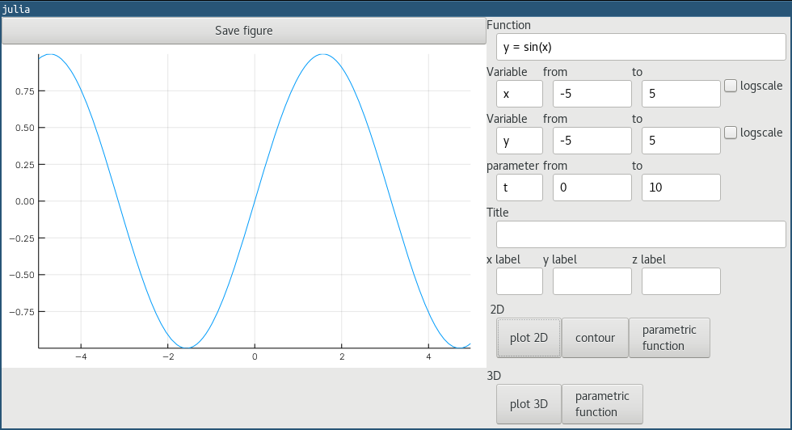
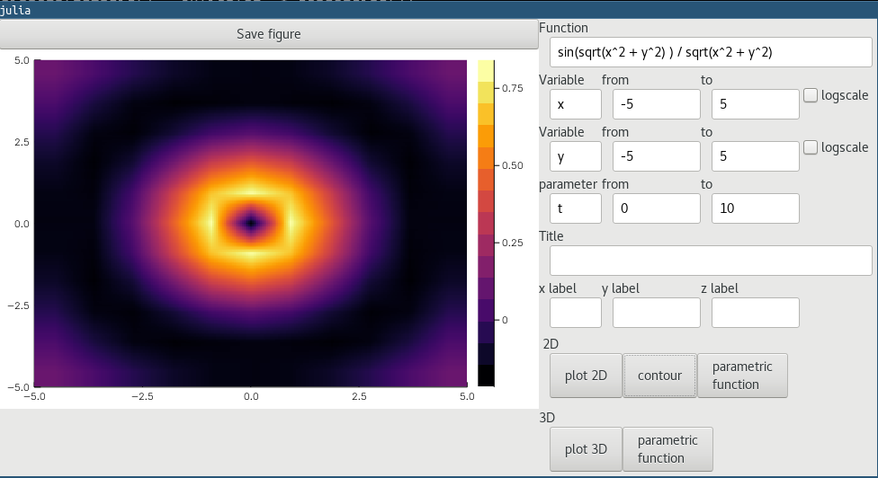
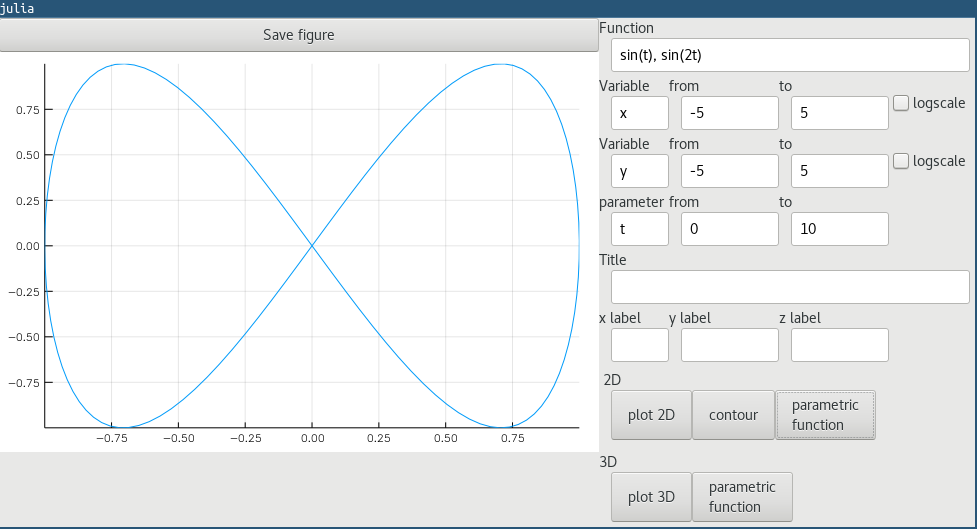
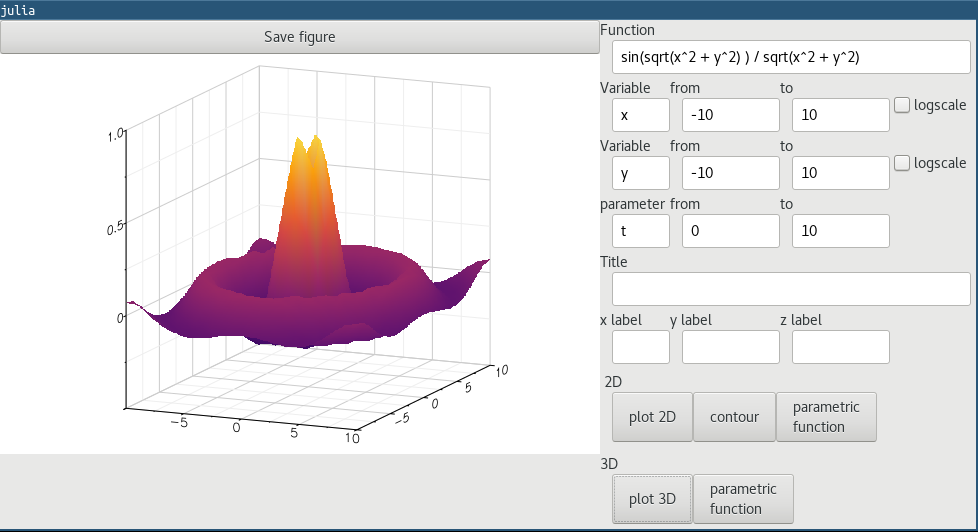
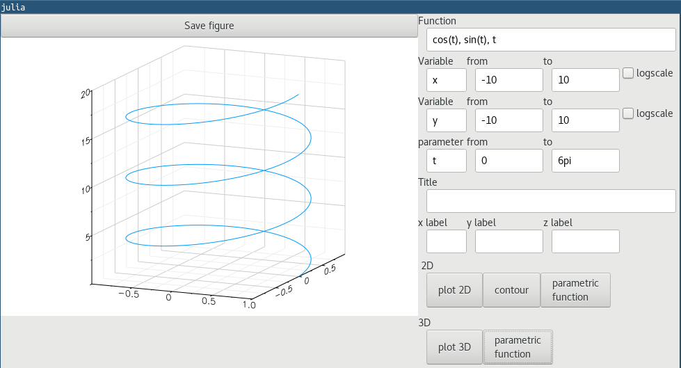

# GtkFunctionPlot

[](https://travis-ci.org/goropikari/GtkFunctionPlot.jl)

[](https://coveralls.io/github/goropikari/GtkFunctionPlot.jl?branch=master)

[](http://codecov.io/github/goropikari/GtkFunctionPlot.jl?branch=master)


## Installation and usage
```julia
Pkg.clone("https://github.com/goropikari/GtkFunctionPlot.jl")
using GtkFunctionPlot
```

# Sample
## plot 2d
```
sin(x) # or y = sin(x)
```


## contour
``` 
sin(sqrt(x^2 + y^2) ) / sqrt(x^2 + y^2) # or z = sin(sqrt(x^2 + y^2) ) / sqrt(x^2 + y^2)
```


## 2d parametric function
```
sin(t), sin(2t) # or x = sin(t), y = sin(2t)
```


## plot 3d
```
sin(sqrt(x^2 + y^2) ) / sqrt(x^2 + y^2) # or z = sin(sqrt(x^2 + y^2) ) / sqrt(x^2 + y^2)
```


## 3d parametric function
```
cos(t), sin(t), t # x = cos(t), y = sin(t), z = t
```

